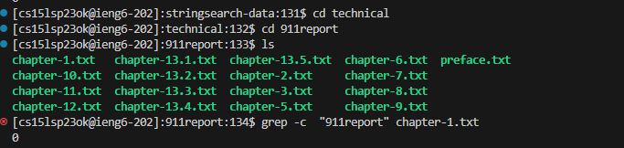

>
**Name:Chaklam Ng**
>
**Professor Joe**
>
**CSE 15L**
>
**05/10/2023**
___
# Lab Report 3
___
# Research Commands
[Geekforgeek Researching website for command grep](https://www.geeksforgeeks.org/grep-command-in-unixlinux/)
>
The command that I chose to research on is `grep` which refering to geeksforgeek's definition,grep is a filter that searches a file for a given particular pattern of characters and return all lines that matches the pattern.
There are some expansions on how to use grep command for searching more options. The first option that I used is `grep -c`. The following screenshot is the actual output that I got from searching on a file from `./techinal` directory.
## grep -c

```
[cs15lsp23ok@ieng6-202]:stringsearch-data:131$ cd technical
[cs15lsp23ok@ieng6-202]:technical:132$ cd 911report
[cs15lsp23ok@ieng6-202]:911report:133$ ls
chapter-1.txt   chapter-13.1.txt  chapter-13.5.txt  chapter-6.txt  preface.txt
chapter-10.txt  chapter-13.2.txt  chapter-2.txt     chapter-7.txt
chapter-11.txt  chapter-13.3.txt  chapter-3.txt     chapter-8.txt
chapter-12.txt  chapter-13.4.txt  chapter-5.txt     chapter-9.txt
[cs15lsp23ok@ieng6-202]:911report:134$ grep -c  "911report" chapter-1.txt
0
```

```
[cs15lsp23ok@ieng6-202]:911report:135$ grep -c  "The four men" chapter-1.txt
2
```
The first example that I tried was to search how many lines that will match the pattern with string "911report". The output is 0 because there does not exist any line match this pattern. The second example that I chose was to find how many lines that will match the pattern
"The four men" which is one of the practice that I have done from skill demo.
The command is useful because we can utilize it to search how many lines in the particular file will contain a content or pattern that we want. 

## grep -n
`grep -n` will technically display the matched lines and their line numbers with the specified pattern.
### Example1:
```
[cs15lsp23ok@ieng6-202]:911report:136$ grep -n "Islam" chapter-2.txt
9:                "World Islamic Front." A fatwa is normally an interpretation of Islamic law by a
10:                respected Islamic authority, but neither Bin Ladin, Zawahiri, nor the three others
11:                who signed this statement were scholars of Islamic law. Claiming that America had
26:                Islamic names often do not follow the Western practice of the consistent use of
42:                Islam, and celebrated recent suicide bombings of American military facilities in the
60:                destroy America and bring the world to Islam.
67:                his message are largely unknown to many Americans. Seizing on symbols of Islam's
72:                selectively draws from multiple sources-Islam, history, and the region's political
75:                Saudi Arabia, the home of Islam's holiest sites. He spoke of the suffering of the
78:            Islam Islam (a word that literally means "surrender to the will of God") arose in
86:                the Qur'an and the Hadith. Islam is divided into two main branches, Sunni and Shia.
98:                happened then-the spread of Islam from the Arabian Peninsula throughout the Middle
102:            Nostalgia for Islam's past glory remains a powerful force.
103:            Islam is both a faith and a code of conduct for all aspects of life. For many
111:                over all aspects of life. Periodically, the Islamic world has seen surges of what,
122:            The extreme Islamist version of history blames the decline from Islam's golden age on
124:                leaving Islam vulnerable to encroaching foreign powers eager to steal their land,
127:                extreme view of Islamic history designed to appeal mainly to Arabs and Sunnis. He
137:                attempting to overthrow the government, Qutb mixed Islamic scholarship with a very
147:                Prophet Mohammed). Qutb argued that humans can choose only between Islam and
149:                jahiliyya and its material comforts than to his view of Islam; jahiliyya could
150:                therefore triumph over Islam. Third, no middle ground exists in what Qutb conceived
160:                say that America had attacked Islam; America is responsible for all conflicts
173:                to Islam, and end the immorality and godlessness of its society and culture:"It is
176:                Islamic nation, a nation that al Qaeda's leaders said "desires death more than you
179:            History and Political Context Few fundamentalist movements in the Islamic world
206:                interpretation of Islam, Wahhabism. The Saudi government, always conscious of its
207:                duties as the custodian of Islam's holiest places, joined with wealthy Arabs from
210:                Islamic doctrine. In this competition for legitimacy, secular regimes had no
212:                local Islamist movements by ceding control of many social and educational issues.
213:                Emboldened rather than satisfied, the Islamists continued to push for power-a trend
214:                especially clear in Egypt. Confronted with a violent Islamist movement that killed
216:                Islamic militants with harassment of moderate Islamic scholars and authors, driving
218:                power by a pious public stance and an embrace of unprecedented Islamist influence on
220:            These experiments in political Islam faltered during the 1990s: the Iranian
222:                that most of its population had little enthusiasm for fundamentalist Islam. Islamist
224:                political power except in Iran and Sudan. In Algeria, where in 1991 Islamists seemed
277:            "All Americans must recognize that the face of terror is not the true face of Islam,"
278:                President Bush observed." Islam is a faith that brings comfort to a billion people
282:                Islam's most extreme, fundamentalist traditions as his match. All these
288:                in the one great successful experience for Islamic militancy in the 1980s: the
300:            A decade of conflict in Afghanistan, from 1979 to 1989, gave Islamist extremists a
331:                the world, including the United States. Some were set up by Islamic extremists or
361:                favored continuing to fight in Afghanistan until it had a true Islamist government.
369:            Through writers like Qutb, and the presence of Egyptian Islamist teachers in the
370:                Saudi educational system, Islamists already had a strong intellectual influence on
371:                Bin Ladin and his al Qaeda colleagues. By the late 1980s, the Egyptian Islamist
373:                assassination-was centered in two major organizations: the Islamic Group and the
374:                Egyptian Islamic Jihad. A spiritual guide for both, but especially the Islamic
381:                who led a strong faction of the Egyptian Islamic Jihad. Many of his followers became
387:                Islamic extremists that a Sudanese political leader, Hassan al Turabi, urged him to
388:                transplant his whole organization to Sudan. Turabi headed the National Islamic Front
401:                Kingdom, Bin Ladin and a number of Islamic clerics began to publicly denounce the
405:                of attending an Islamic gathering in Pakistan in April 1991.33 By 1994, the Saudi
427:                Egyptian Islamic Jihad both as a source and conduit for finances and as a support
434:                confederation. In Sudan, he established an "Islamic Army Shura" that was to serve as
438:                building this Islamic army, he enlisted groups from Saudi Arabia, Egypt, Jordan,
447:            Bin Ladin also provided equipment and training assistance to the Moro Islamic
452:            Al Qaeda helped Jemaah Islamiya (JI), a nascent organization headed by Indonesian
453:                Islamists with cells scattered across Malaysia, Singapore, Indonesia, and the
456:                Afghanistan border to assist the Tajikistan Islamists in the ethnic conflicts that
477:                Islamic lands. Specifically singling out U.S. forces for attack, the language
482:            By this time, Bin Ladin was well-known and a senior figure among Islamist extremists,
501:                Islamist groups were focused on local battles, such as those in Egypt, Algeria,
509:                Yemen headed by a Yemeni member of Bin Ladin's Islamic Army Shura; some in the group
557:                corner of the Muslim world. His vision mirrored that of Sudan's Islamist leader,
558:                Turabi, who convened a series of meetings under the label Popular Arab and Islamic
560:                violent Islamist extremists came from all the groups represented in Bin Ladin's
561:                Islamic Army Shura. Representatives also came from organizations such as the
579:                though Iraq's dictator, Saddam Hussein, had never had an Islamist agenda-save for
582:                Islamists in Iraqi Kurdistan, and sought to attract them into his Islamic army.
586:                this pledge, at least for a time, although he continued to aid a group of Islamist
590:                Islam. There are indications that by then the Iraqi regime tolerated and may even
591:                have helped Ansar al Islam against the common Kurdish enemy.
603:                large part because Bin Ladin lost his base in Sudan. Ever since the Islamist regime
614:                Egyptian Islamic Group, had been sheltered in Sudan and helped by Bin Ladin.
623:                Islamic army that he could no longer protect them and that they had to leave the
624:                country. Outraged, several Libyan members of al Qaeda and the Islamic Army Shura
671:                derived from Islam, but its politics had been decidedly secular. The army was-and
676:                Pakistani politics. After a coup in 1977, military leaders turned to Islamist groups
678:                form of Islamic fundamentalism, which had developed in the nineteenth century at a
681:            The influence of the Wahhabi school of Islam had also grown, nurtured by Saudifunded
687:                men with no marketable skills but with deeply held Islamic views.
691:                Taliban movement, espousing a ruthless version of Islamic law, perhaps could bring
701:                organizations for recruiting and training fighters for Islamic insurgencies in such
732:                a provincial council of Islamic leaders who were not major contenders for national
735:                Gulbuddin Hekmatyar, who, though an Islamic extremist, was also one of the Taliban's
797:                such facilities in Afghanistan made available to the global network of Islamist
830:            Now effectively merged with Zawahiri's Egyptian Islamic Jihad, al Qaeda promised to become the general headquarters for international
831:                terrorism, without the need for the Islamic Army Shura. Bin Ladin was prepared to
893:                organization and Zawahiri's Egyptian Islamic Jihad. Less than a month after the
912:                enemies of Islam and to expel the Americans from the Gulf region. Two weeks after
924:                attacks had already been faxed to the joint al Qaeda-Egyptian Islamic Jihad office
926:                Quds al Arabi. One proclaimed "the formation of the Islamic Army for the Liberation
928:                had been carried out by a "company" of a "battalion" of this "Islamic Army."
941:                permissible under Islam." Asked if he had indeed masterminded these bombings, Bin
942:                Ladin said that the World Islamic Front for jihad against "Jews and Crusaders" had
```
### Example 2:
```
[cs15lsp23ok@ieng6-202]:911report:137$ grep -n "cells" chapter-2.txt
453:                Islamists with cells scattered across Malaysia, Singapore, Indonesia, and the
720:                Shura but also as supervisor of the cells and prospective operations in East
900:                Members of the cells rented residences, and purchased bomb-making materials and
917:            By August 1, members of the cells not directly involved in the attacks had mostly
```
In particular, I used the commands `grep -n "Islam" chapter-2.txt` and `grep -n "cells" chapter-2.txt` respectively for each example. However, it typically return all lines including the lines numbers that matched the pattern to me. This command is useful because it can help us
find the lines that match the pattern easily and faster to locate the line numbers without mannually looking for them.

## grep -w
`grep -w` is the command that will only return the lines that exactly match the given pattern which litearlly means words are same as the pattern and pattern are not just a substring of the words.
### Example1:
```
[cs15lsp23ok@ieng6-202]:911report:138$ grep -w "men" chapter-1.txt
    Tuesday, September 11, 2001, dawned temperate and nearly cloudless in the eastern United States. Millions of men and women readied themselves for work. Some made their way to the Twin Towers, the signature structures of the World Trade Center complex in New York City. Others went to Arlington, Virginia, to the Pentagon. Across the Potomac River, the United States Congress was back in session. At the other end of Pennsylvania Avenue, people began to line up for a White House tour. In Sarasota, Florida, President George W. Bush went for an early morning run.
    While Atta had been selected by CAPPS in Portland, three members of his hijacking team-Suqami, Wail al Shehri, and Waleed al Shehri-were selected in Boston. Their selection affected only the handling of their checked bags, not their screening at the checkpoint. All five men cleared the checkpoint and made their way to the gate for American 11. Atta, Omari, and Suqami took their seats in business class (seats 8D, 8G, and 10B, respectively). The Shehri brothers had adjacent seats in row 2 (Wail in 2A, Waleed in 2B), in the firstclass cabin. They boarded American 11 between 7:31 and 7:40. The aircraft pushed back from the gate at 7:40.
    Washington Dulles: American 77. Hundreds of miles southwest of Boston, at Dulles International Airport in the Virginia suburbs of Washington, D.C., five more men were preparing to take their early morning flight. At 7:15, a pair of them, Khalid al Mihdhar and Majed Moqed, checked in at the American Airlines ticket counter for Flight 77, bound for Los Angeles. Within the next 20 minutes, they would be followed by Hani Hanjour and two brothers, Nawaf al Hazmi and Salem al Hazmi.
    The four men passed through the security checkpoint, owned by United Airlines and operated under contract by Argenbright Security. Like the checkpoints in Boston, it lacked closed-circuit television surveillance so there is no documentary evidence to indicate when the hijackers passed through the checkpoint, what alarms may have been triggered, or what security procedures were administered. The FAA interviewed the screeners later; none recalled anything unusual or suspicious.
    The four men boarded the plane between 7:39 and 7:48. All four had seats in the first-class cabin; their plane had no business-class section. Jarrah was in seat 1B, closest to the cockpit; Nami was in 3C, Ghamdi in 3D, and Haznawi in 6B.
    The 19 men were aboard four transcontinental flights.
 ```
 >
 ### Example2:
 ```
 [cs15lsp23ok@ieng6-202]:911report:140$ grep -w "me" chapter-1.txt 
    SecDef: OK, let me ask the question here. Has that directive been transmitted to the aircraft?
 ```
 `grep -w "men" chapter-1.txt` and `grep -w "me" chapter-1.txt` are the commands that I used on each example. However, "me" is a substring of "men" but it will not return any lines that matched "men" only since we used `grep -w` command to find the exact pattern matching lines.
 This command is useful because we can find all lines that has exactly pattern matching but not substrings.
 ___
 Thank you for taking time to review my lab report-3
 
